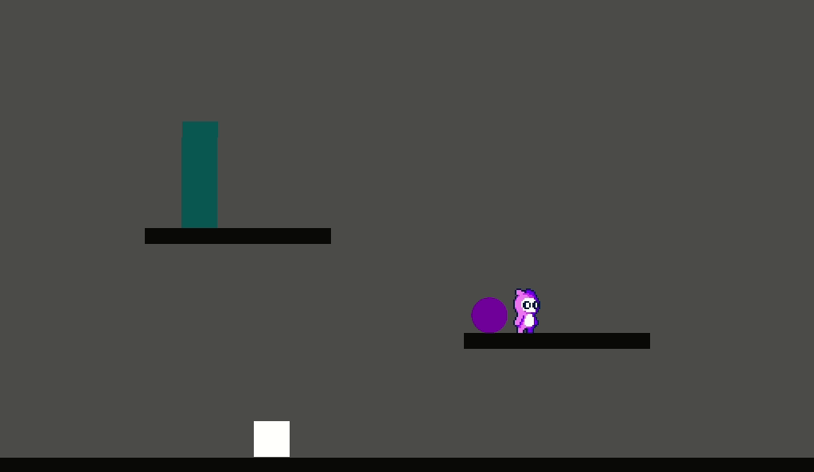

## Godot Rewind Mechanic

### Note

Experiment to implement rewind mechanic in Godot engine.
It's all pretty messy right now. But the essentials for
the rewind effect are `rewind_system.gd` and `rewinder.gd`.

### Controls

movement - `WASD`
rewind - `Shift`

### How it works

You basically record a limited amount of data, popping the oldest entry
when you reach the maximum amount of recorded data.

This data, includes position and other rewindable data depending on the situation.

### Implementation
            
The rewind effect is created by adding a plain `Node` as a child of the `Node2D` you want to be able to rewind and attach the `rewinder.gd` script to it. The `rewinder.gd` script records only the `global_position` of it's parent node (i.e. the Node you want to rewind).

You can however, extend the `rewinder.gd` script and override the `__record()` and `__rewind(data)` methods, to specify the data you want to record.
An example of this is in `player_rewinder.gd`.

### Issues

There's a bug when rewinding the falling stack which I can't figure out right now. Don't know why it happens, but the stack doesn't return back to normal once you stop rewinding, but the blocks just move back to the position you rewinded them out of... weird.